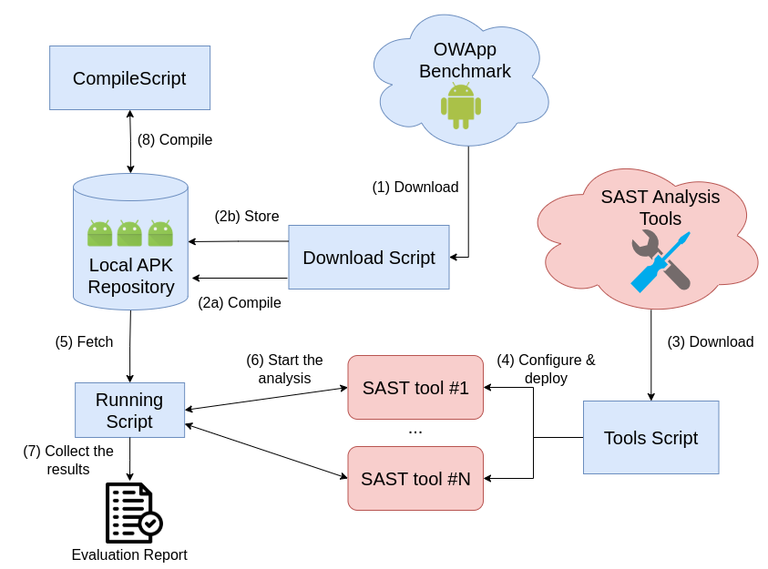
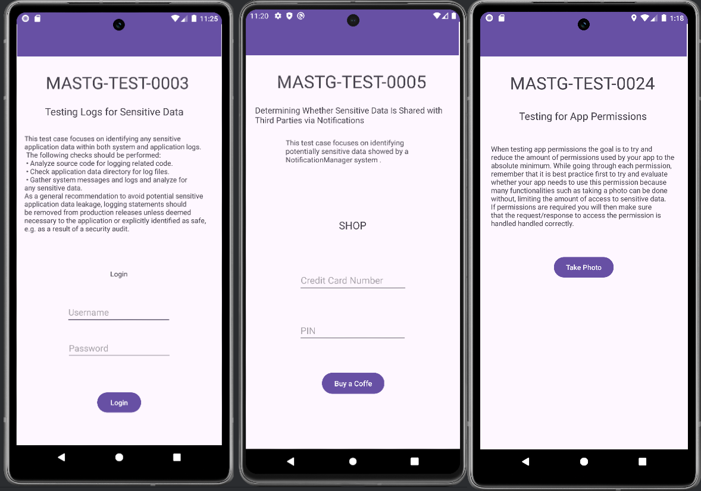

# OWApp Benchmark Suite


The Benchmarking Suite for Mobile Security Applications (OWApp) is a comprehensive framework designed to automate and enhance the benchmarking process for mobile applications, particularly within the context of security analysis. Figure 1 gives an overview of this framework, which is structured into three parts. This suite is built upon a structured workflow that includes three primary scripts, each serving a distinct role in the overall process: the **Download Script**, the **Tools Script**, and the **Running Script**.  
All the tools are tested on an experimental setup of Ubuntu 24.04.1.

### Download Script
The Download Script is the initial component of the benchmarking process. Its primary function is to facilitate the automated download of mobile security applications from the OWApp dataset.  
This script starts by installing Curl[^1], a command line tool and library for transferring data with URLs, and using it to download the latest version of OWApp from GitHub[^2].  
The downloaded applications are saved in the local environment, ready for further processing by the Tools Script and the Running Script.
Moreover the DownloadScript offers the possibility of directly compile all the application with a SDK version defined by the user through the flag `-compileAll`

### Tools Script
The Tools Script plays a crucial role in preparing the benchmarking environment by ensuring that the necessary SAST tools are installed and properly configured on the user's workstation. This script serves as the bridge between the raw downloaded applications and the security analysis process.  
The Tools Script creates a secure environment where all the tools are installed and are ready to be used from the Running Script. It starts by updating the system and installing the necessary components required by the tools: GCC[^3], Python3-pip[^4], Python3.12-venv[^5], OpenJDK-11[^6], Go[^7], Jadx[^8], and Dex2Jar[^9]. Afterward, it proceeds with installing and configuring Pyenv, followed by creating a virtual environment folder. Next, it installs and sets up Docker[^10]. Once Docker is ready, the selected SAST tools are installed.

### Running Script
The Running Script is designed to conduct security analysis and generate report files on the downloaded applications using Static Application Security Testing (SAST) tools.  
Once the applications are downloaded, this script executes the chosen SAST tools on the locally chosen stored apps. These tools perform a thorough analysis, scanning the applications for potential security vulnerabilities and generating detailed reports in JSON format.  
The Running Script requires a working directory where the application in APK format is stored. For each app in the working directory, the SAST tools are launched.

### Compile Script
The Compile Script is designed to set up the Android SDK environment and compile Android applications, preparing them for subsequent security analysis. This script automates the setup of essential development tools, including the Android SDK and necessary platform packages, and enables smooth compilation of apps by resolving dependencies and configuring environment variables.

Once the Android SDK is installed and configured, this script uses the `gradlew` command to compile each application in debug mode, creating APK files in a specified format. These compiled APKs can then be analyzed by other tools, such as SAST tools, to detect security vulnerabilities or perform other forms of testing.

The Compile Script requires a working directory containing the app's source code and Gradle wrapper (`gradlew`). For each app in this directory, it installs the appropriate SDK platform versions and performs the build process, outputting compiled APK files to be used in further analysis.

*Figure 1: Benchmarking Suite*

## Benchmarking Suite Work Flow
In this section, I will explain the steps to use the Benchmarking Suite in a correct and complete way. Starting from downloading the suite, the first step is to give the execution permission to all the scripts.

1. Open the terminal in the Benchmarking Suite directory and run the following command:
```bash
chmod +x ./*
```

2. After giving permission to execute all the scripts, run the Download Script:
```bash
./DownloadScript
```
or
```bash
./DownloadScript -compileAll <minSDK> <targetSDK>
```

The result of this script is the OWApp dataset downloaded in the same directory as the Benchmark Suite.

3. After we have the set of mobile applications available locally, we can download all the SAST tools and requisites for it by running the following command:

```bash
./ToolScript
```

The following artifacts were generated inside the Desktop folder:
i) **APKHUNT-main**: This folder contains the APKHunt executable.  
ii) **Mobile-Security-Framework-MobSF-3.9.7**: A folder downloaded from GitHub that allows you to set up and run MobSF locally.  
iii) **Mobsf-main**: This folder contains Python scripts that leverage the MobSF API to upload, run the analysis, and generate reports with MobSF.  
iv) **venv**: This is the virtual environment essential for running the Trueseeing tool.  

iv) Before running the RunningScript, there is the need to update the configuration of the shell environment and activate the virtual environment, opening a new terminal.
```bash
# On a new terminal, reach the Desktop folder and run the following command:
source /venv/bin/activate
```

v) Once all the tools are installed and the environment configured correctly, we can perform security analysis on a single or a set of selected applications.

```bash
./RunningScript <folder_with_apps>
```
The results of the Running Script are four folders in the Desktop directory: APKHunt, SEBASTiAN, Trueseeing, and MobSF. Inside each folder, there is the result of each analysis.

In the next section, I am going to explain how I designed the apps and the structure of the database.

vi) In addition thanks to the CompileScript the user can decide to compile the app with a selecte SDK version
```bash
./CompileScript <path to the src prokect> <minSDK> <targetSDK>
```

## Dataset of Apps
### Design Choice
Given our goals for the repository, we decided to follow the OWASP MASTG structure completely, so we divided our benchmark into 7 categories: Storage, Crypto, Authentication, Network, Platform, Code, and Resilience.

Almost all Android apps use one or more of the following capabilities:
- Store data on the device
- Interact with the Android Platform

Some apps use a web server or another app to exploit the related test. Each app has a common layout and tries to simulate a real-world app. Figure \ref{fig
} shows some graphical layout patterns used for the app implementations.

*Figure 2: Application Layout*

All the apps are developed through Android Studio Jellyfish 2023.3.1 Patch 2, and all the apps have an API version of 26, which is the minimum constraint for developing apps with specific vulnerabilities.

### Structure and Content
The repository contains top-level folders apk and src. Inside each folder, there are category folders corresponding to various categories of vulnerabilities: Storage, Crypto, Authentication, Network, Platform, Code, and Resilience.

Inside each category, there is the OWASP MASTG test with a README file that describes each static vulnerability as outlined in the MASTG and how I implemented the test.
### Test Implementation

Each app in the dataset was implemented based on the vulnerability descriptions provided in the corresponding OWASP MASVS requirement and its associated MASTG security control.

For some tests, I directly used code snippets included in the description of the OWASP requirement or control. For instance, in the app `MASTG-TEST0013: Testing Symmetric Cryptography`, I included the code that encrypts and decrypts text using the Advanced Encryption Standard (AES) with a hard-coded encryption key.

```java
public class Decrypt extends AppCompatActivity {
    private static byte[] keyBytesAES;
    private static byte[] keyBytesDES;

    static {
        Decrypt.keyBytesDES = "12345678".getBytes();
        Decrypt.keyBytesAES = new byte[] {7, 3, 4, 5, 6, 7, 8, 9, 16, 17, 18, 9, 20, 21, 15, 1};
    }

    private CharSequence encryptDataAES(String data) {
        // encryption logic
    }

    private CharSequence encryptDataDES(String data) {
        // encryption logic
    }
}

```
When the code snippets are not available, I search in the MASTG for any links to external guides or search the Android Developers guide. An example of an app implemented with the help of a guide provided by the MASTG is MASTG-TEST-0043: Memory Corruption Bugs. In this test, the MASTG provides two useful links to external guides that helped me implement the test. For this test, I created a Timer app following the guide "9 ways to avoid memory leaks in Android". The timer is never canceled, causing a memory leak.
```java
public class MainActivity extends AppCompatActivity {
    private CountDownTimer countDownTimer;

    @Override
    protected void onCreate(Bundle savedInstanceState) {
        // initialization logic
        Button start = findViewById(R.id.button);
        start.setOnClickListener(new View.OnClickListener() {
            @Override
            public void onClick(View v) {
                startTimer();
            }
        });
    }

    // Mistake 1: Cancel Timer is never called
    public void cancelTimer() {
        if (countDownTimer != null) countDownTimer.cancel();
    }

    private void startTimer() {
        // timer logic
    }
}
```

If the official documentation and references do not provide sufficient details, I extended the analysis to platforms like Stack Overflow and GitHub, and I generated code samples using the ChatGPT AI chatbot. The information collected was then used to implement the vulnerable apps.

An example of an app developed using this approach is MASTG-TEST-0025: Testing for Injection Flaws. Inspired by the GitHub repository of Payatu Security Consulting, I created an application with a login feature that checks user credentials against an SQL database stored in internal storage. The app does not sanitize user input, making it vulnerable to SQL injection attacks.

```java
public void search(View view) {
    EditText srchtxt = (EditText) findViewById(R.id.search);
    EditText pwd = findViewById(R.id.editTextTextPassword);

    if (!srchtxt.getText().toString().matches("") || !pwd.getText().toString().matches("")) {
        Cursor cr = null;
        try {
            cr = mDB.rawQuery("SELECT * FROM sqliuser WHERE user = '" + srchtxt.getText().toString() + "' AND password= '" + pwd.getText().toString() + "'", null);
            StringBuilder strb = new StringBuilder("");
            
            if ((cr != null) && (cr.getCount() > 0)) {
                cr.moveToFirst();
                do {
                    strb.append("User: (" + cr.getString(0) + ") pass: (" + cr.getString(1) + ") Credit card: (" + cr.getString(2) + ")\n");
                } while (cr.moveToNext());
                
                Intent myIntent = new Intent(MainActivity.this, Activity2.class);
                startActivity(myIntent);
            } else {
                strb.append("User: (" + srchtxt.getText().toString() + ") not found");
            }
            Toast.makeText(MainActivity.this, strb.toString(), Toast.LENGTH_SHORT).show();
        } catch (Exception e) {
            Log.d("sqli", "Error occurred while searching in database: " + e.getMessage());
        }
    } else {
        Toast.makeText(MainActivity.this, "Fill the form!", Toast.LENGTH_SHORT).show();
    }
}
```

With this code, entering ' or 1=1 -- - as the username allows an attacker to bypass authentication through an SQL injection attack.

All the apps are developed using Android Studio Jellyfish 2023.3.1 Patch 2, and all the apps have an API version of 26, which is the minimum constraint for developing apps with specific vulnerabilities.

### Support Scripts
This suite is built upon a structured workflow that includes three primary scripts, each serving a distinct role in the overall process: the Download Script, the Tools Script, and the Running Script.

**Download Script**: The Download Script is the initial component of the benchmarking process. Its primary function is to facilitate the automated download of mobile security applications from the OWApp dataset. This script installs Curl and uses it to download from GitHub the latest version of the dataset. The downloaded apps are saved in the local environment, ready for further processing by the Tools Script and the Running Script.

**Tools Script**: The Tools Script plays a crucial role in preparing the benchmarking environment by ensuring that the necessary SAST tools are installed and properly configured. It starts by updating the system and then installs required components like GCC, Python3-pip, Python3.12-venv, OpenJDK-11, Go, Jadx, and Dex2Jar. After that, it proceeds with installing and setting up Docker and the selected SAST tools.

**Running Script**: The Running Script conducts security analysis on the downloaded applications using the SAST tools and generates report files. It requires a working directory where the APK files are stored. For each app in the directory, the SAST tools are launched for analysis, and detailed reports are generated in JSON format.

**Compile Script**:This script sets up the Android development environment, installs the necessary SDK platforms, and compiles the app with the SDK version choosen by the user

### Workflow
The initial step involves using the Download Script to download the entire dataset of apps on the local machine (Steps 1 and 2a in Figure). The Tools Script supports the download (Step 3) and the automatic deployment and configuration of a set of Android SAST tools (Step 4). The script facilitates the deployment of several state-of-the-art SAST tools, including MobSF, Sebastian, TrueeSeeing, and APKHunt. Finally, the Running Script initiates the security analysis of the configured SAST tools against the apps in the OWApp dataset (Step 6). This script also collects and stores the analysis results in a report folder for further review (Step 7).

### Illustrative Example
I used the OWApp Benchmarking Suite to perform security analyses on an Android app with a sample SAST tool, i.e., SEBASTiAn. I tested MASTG-TEST0001 to perform this test. After the security analysis execution, a report file is created in a dedicated folder named after the tool that performed the analysis. The following listing shows all the commands to use the Benchmarking Suite properly.
```bash
chmod +x ./* ; ./DownloadScript ; ./ToolScript
# On a new terminal, reach the Desktop folder and run the following command:
source venv/bin/activate
./RunningScript $HOME/Desktop/OWApp-Benchmarking-Suite/OWApp/src/Storage/MASTG-TEST0001

#Compile application with a specific SDK version
./CompileScript <path to the src prokect> <minSDK> <targetSDK>
```
