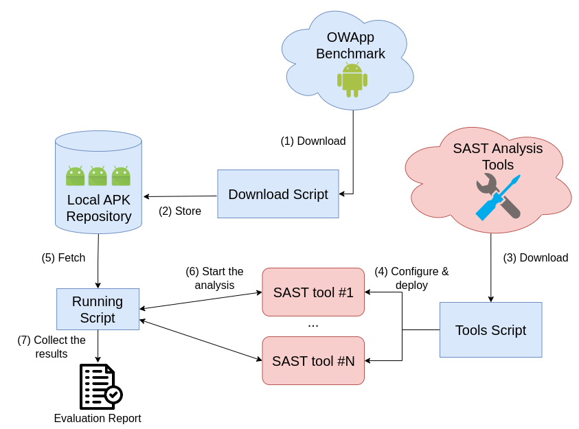

# OWApp Benchmark Suite

*Figure 1: Benchmarking Suite*

The Benchmarking Suite for Mobile Security Applications (OWApp) is a comprehensive framework designed to automate and enhance the benchmarking process for mobile applications, particularly within the context of security analysis. Figure 1 gives an overview of this framework, which is structured into three parts. This suite is built upon a structured workflow that includes three primary scripts, each serving a distinct role in the overall process: the **Download Script**, the **Tools Script**, and the **Running Script**.  
All the tools are tested on an experimental setup of Ubuntu 24.04.1.

### Download Script
The Download Script is the initial component of the benchmarking process. Its primary function is to facilitate the automated download of mobile security applications from the OWApp dataset.  
This script starts by installing Curl[^1], a command line tool and library for transferring data with URLs, and using it to download the latest version of OWApp from GitHub[^2].  
The downloaded applications are saved in the local environment, ready for further processing by the Tools Script and the Running Script.

### Tools Script
The Tools Script plays a crucial role in preparing the benchmarking environment by ensuring that the necessary SAST tools are installed and properly configured on the user's workstation. This script serves as the bridge between the raw downloaded applications and the security analysis process.  
The Tools Script creates a secure environment where all the tools are installed and are ready to be used from the Running Script. It starts by updating the system and installing the necessary components required by the tools: GCC[^3], Python3-pip[^4], Python3.12-venv[^5], OpenJDK-11[^6], Go[^7], Jadx[^8], and Dex2Jar[^9]. Afterward, it proceeds with installing and configuring Pyenv, followed by creating a virtual environment folder. Next, it installs and sets up Docker[^10]. Once Docker is ready, the selected SAST tools are installed.

### Running Script
The Running Script is designed to conduct security analysis and generate report files on the downloaded applications using Static Application Security Testing (SAST) tools.  
Once the applications are downloaded, this script executes the chosen SAST tools on the locally chosen stored apps. These tools perform a thorough analysis, scanning the applications for potential security vulnerabilities and generating detailed reports in JSON format.  
The Running Script requires a working directory where the application in APK format is stored. For each app in the working directory, the SAST tools are launched.

## Benchmarking Suite Work Flow
In this section, I will explain the steps to use the Benchmarking Suite in a correct and complete way. Starting from downloading the suite, the first step is to give the execution permission to all the scripts.

1. Open the terminal in the Benchmarking Suite directory and run the following command:
```bash
chmod +x ./*
```

2. After giving permission to execute all the scripts, run the Download Script:
```bash
./DownloadScript
```

The result of this script is the OWApp dataset downloaded in the same directory as the Benchmark Suite.

3. After we have the set of mobile applications available locally, we can download all the SAST tools and requisites for it by running the following command:

```bash
./ToolScript
```

The following artifacts were generated inside the Desktop folder:
i) **APKHUNT-main**: This folder contains the APKHunt executable.  
ii) **Mobile-Security-Framework-MobSF-3.9.7**: A folder downloaded from GitHub that allows you to set up and run MobSF locally.  
iii) **Mobsf-main**: This folder contains Python scripts that leverage the MobSF API to upload, run the analysis, and generate reports with MobSF.  
iv) **venv**: This is the virtual environment essential for running the Trueseeing tool.  

iv) Before running the RunningScript, there is the need to update the configuration of the shell environment and activate the virtual environment, opening a new terminal.
```bash
# On a new terminal, reach the Desktop folder and run the following command:
source /venv/bin/activate
```

v) Once all the tools are installed and the environment configured correctly, we can perform security analysis on a single or a set of selected applications.

```bash
./RunningScript <folder_with_apps>
```
The results of the Running Script are four folders in the Desktop directory: APKHunt, SEBASTiAN, Trueseeing, and MobSF. Inside each folder, there is the result of each analysis.

In the next section, I am going to explain how I designed the apps and the structure of the database.

## Dataset of Apps
### Design Choice
Given our goals for the repository, we decided to follow the OWASP MASTG structure completely, so we divided our benchmark into 7 categories: Storage, Crypto, Authentication, Network, Platform, Code, and Resilience.

Almost all Android apps use one or more of the following capabilities:
- Store data on the device
- Interact with the Android Platform

Some apps use a web server or another app to exploit the related test. Each app has a common layout and tries to simulate a real-world app. Figure \ref{fig
} shows some graphical layout patterns used for the app implementations.


All the apps are developed through Android Studio Jellyfish 2023.3.1 Patch 2, and all the apps have an API version of 26, which is the minimum constraint for developing apps with specific vulnerabilities.

### Structure and Content
The repository contains top-level folders apk and src. Inside each folder, there are category folders corresponding to various categories of vulnerabilities: Storage, Crypto, Authentication, Network, Platform, Code, and Resilience.

Inside each category, there is the OWASP MASTG test with a README file that describes each static vulnerability as outlined in the MASTG and how I implemented the test.
### Test Implementation

For implementing the tests, I tried to follow the MASTG as closely as possible. For some tests, the MASTG provides snippets of vulnerable code. When these snippets are available, I use them to implement the app.

An example of this methodology is MASTG-TEST0013: Testing Symmetric Cryptography, which provides snippets of vulnerable code to use for static encryption and decryption. For this test, I created an app that encrypts and decrypts text using Advanced Encryption Standard (AES). We can clearly detect the use of a static encryption key, which is directly encoded and initialized in the static byte array keyBytes.

When the code snippets are not available, I search the MASTG for links to external guides or refer to the Android Developers guide. An example of an app implemented with the help of a guide provided by the MASTG is MASTG-TEST-0043: Memory Corruption Bugs. In this test, the MASTG provides two useful links to external guides that helped me implement the test. For this test, I created a Timer app following this guide: 9 Ways to Avoid Memory Leaks in Android. The timer is never canceled, causing a memory leak. To fix this, add:
```bash
/*
 * Fix 1: Cancel Timer when 
 * the activity is about to be destroyed
 */
@Override
protected void onDestroy() {
    super.onDestroy();
    cancelTimer();
}

```

If external guides are also unavailable, I thoroughly study the test and develop an app using code snippets found on Stack Overflow or GitHub, and ideas for apps developed by Large Language Models.

An example of an app implemented with this strategy is MASTG-TEST-0025: Testing for Injection Flaws. For this test, inspired by the GitHub repository of Payatu Security Consulting, I created an application with a login feature that checks credentials against an SQL database stored in internal storage. The application does not sanitize user input, making it susceptible to SQL injection attacks.

For instance, using the input ' or 1=1 -- - as the username allows an attacker to bypass authentication.


